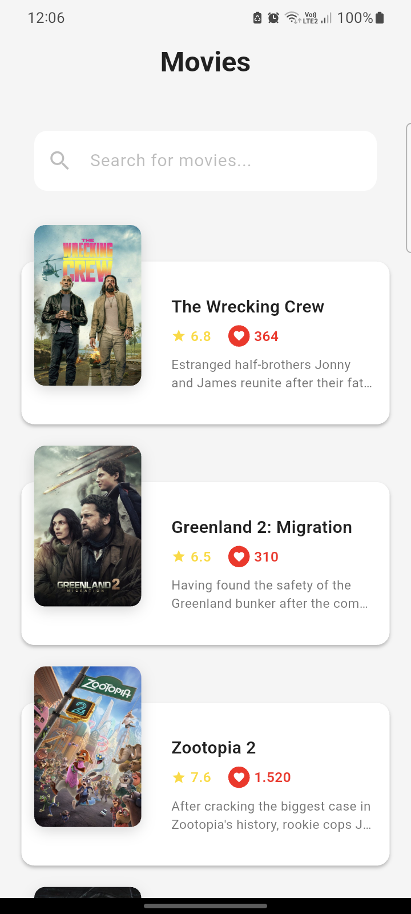
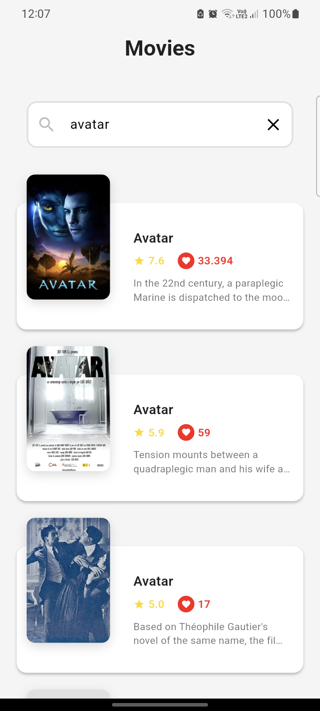
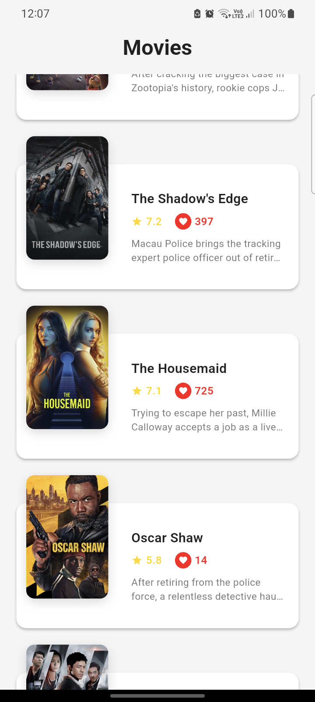

# Movie App - Task Submission

## Overview

Flutter application integrating with TMDB API for browsing popular movies, searching titles, and viewing detailed movie information. Built with Clean Architecture and comprehensive testing.

## Screenshots

| Home Screen | Search | Movie Details |
|------------|--------|---------------|
|  |  |  |

## Completed Requirements

✅ **Step 1-2**: UI Implementation with Material Design 3  
✅ **Step 3**: TMDB API Integration with Clean Architecture  
✅ **Bonus**: Code refactoring (35+ constants, 12 text styles) and 12 unit/widget tests

## Key Features

- Browse popular movies with poster grid layout
- Real-time search functionality
- Detailed movie info (cast, ratings, budget, revenue, genres)
- Offline caching with SharedPreferences
- Hero animations between screens
- Professional error handling and loading states

## Architecture

**Clean Architecture** implementation with three layers:
- **Domain**: Business entities (Movie, MovieDetail, Cast)
- **Data**: API integration, JSON models, repositories, local caching
- **Presentation**: Provider state management, screens, reusable widgets

## Technologies

- **Flutter**: ^3.5.3
- **State Management**: Provider ^6.1.0
- **HTTP & Caching**: http ^1.2.0, shared_preferences ^2.2.2
- **JSON Serialization**: json_annotation ^4.8.1, json_serializable ^6.8.0
- **Testing**: mockito ^5.4.4, flutter_test

## Testing

**12 tests** covering domain entities and presentation widgets:
- Movie & MovieDetail entity tests (7 tests)
- SearchBarWidget & EmptyStateWidget tests (5 tests)
- **All tests passing** ✅

```bash
flutter test
# Output: 00:07 +12: All tests passed!
```


**API Key**: Already configured in `lib/features/movies/data/datasources/api_constants.dart`

## Code Quality Highlights

✅ Clean Architecture with SOLID principles  
✅ No magic numbers (35+ centralized constants)  
✅ Centralized styling (12 text styles)  
✅ Type-safe JSON serialization  
✅ Comprehensive error handling  
✅ Offline-first caching strategy

---

*Thank you for reviewing this submission.*

